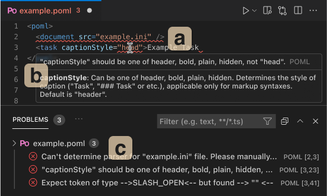
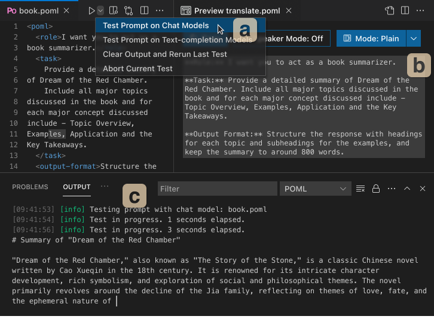

# VS Code IntelliSense Features

POML comes with features that enhance your editing experience in Visual Studio Code, offering a more interactive way to work with your prompt files. Here’s how to make the most of these features:

### Diagnostics

### Hover Tooltips

When you hover over tags, attributes, or expression parts in your `.poml` file, VSCode will display helpful tooltips.

- **Tags:** Hovering over a tag (e.g., `
`) will show you the documentation for that component (if available).
- **Attributes:** Hovering over an attribute (e.g., `speaker` in `
`) will show you the documentation for that attribute, including its type and accepted values.
- **Errors:** Hovering over a problematic element, it will show you the error cause and reason, which will help you understand the issue and fix it.

To use it, simply open your `.poml` file in VSCode and hover over any token.

### Side Preview

The side preview feature shows a live rendering of your prompt. As you make changes, you can see how your prompt structure and styles are applied.

Install the POML VSCode extension, then open your `.poml` file. Activate the side preview panel by:

1. **Click Show Preview Button:** Click the show preview button at the top-right corner of active editor, or type "POML: Open POML Preview" in the command palette and select the command.
2. **Side-by-side:** The preview will update automatically as you edit.

### Auto-completion

Autocompletion assists you by suggesting component tags, attribute names, and possible attribute values. This helps ensure your syntax is correct and speeds up development.

While editing a `.poml` file in VSCode:

- **Tag Completion:** Start typing a tag name (e.g., `<p`). VSCode with the POML extension will offer completions, such as `
`, `<paragraph>`, or other available components. It also suggests closing tags.
- **Attribute Completion:** Inside an opening tag, type a space or start typing an attribute name (e.g., `class`).  You'll see suggestions for valid attributes for that component (e.g., `className`).
- **Attribute Value Completion:**  For some attributes, POML can suggest possible values. For example, if you type `<question speaker="`, you might see suggestions like `"human"` or `"ai"`.

This feature significantly improves the efficiency and accuracy of writing POML code.

## Testing Prompts

## Prompt Gallery

Access pre-built prompt templates from the POML activity bar.

## List of Available Commands

| Command | Description |
|---------|-------------|
| `poml.test` | Test on chat models |
| `poml.testNonChat` | Test on text completion |
| `poml.showPreview` | Open preview |
| `poml.showPreviewToSide` | Open preview to side |